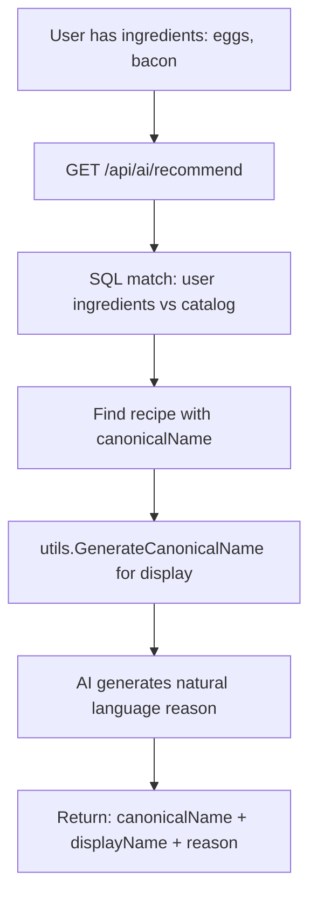

# 🔧 Admin Recipe Creation: Canonical Name Generation Fix

## 🚨 Root Cause Analysis

### Problem
When admins create recipes via **POST /api/admin/recipes/create-ai**, the `canonicalName` was generated incorrectly:

```go
// ❌ OLD CODE (WRONG)
canonicalName := strings.ToLower(strings.ReplaceAll(req.Title, " ", "_"))
```

**Example failure:**
- Input: `"Яичница с беконом"` (Russian)
- Output: `"яичница_с_беконом"` (localized slug) ❌
- Expected: `"scrambled_eggs_with_bacon"` (English slug) ✅

### Impact
- **22 recipes** in catalog
- **3 recipes WITHOUT canonicalName** (NULL values)
- **9 duplicate recipes** due to inconsistent naming
- AI recommendations fail when canonical names don't match

### Technical Context
**Architecture 2025 Principle:** Backend decides (SQL matching), AI explains (natural language)

Canonical names are the **single source of truth** for recipe identification across:
1. Recipe catalog (`RecipeCatalog.canonicalName`)
2. AI recommendations (`GET /api/ai/recommend`)
3. Recipe search (`GET /api/recipes`)
4. User saved recipes (`UserRecipe.localName`)

---

## ✅ Solution Implemented

### 1. Created Shared Utility: `pkg/utils/canonical_name.go`

**Function: `GenerateCanonicalName(localizedTitle string) string`**

Transforms localized recipe names to English slugs:
- `"Яичница"` → `"scrambled_eggs"`
- `"Omlet z warzywami"` → `"vegetable_omelet"`
- `"Scrambled Eggs"` → `"scrambled_eggs"`

**Features:**
- ✅ **60+ known recipe mappings** (ru/pl/en → English)
- ✅ **Transliteration fallback** for unknown recipes
- ✅ **Polish diacritics support** (ł→l, ą→a, etc.)
- ✅ **Cyrillic to Latin** conversion
- ✅ **Snake_case normalization**

**Coverage:**
| Category | Examples |
|----------|----------|
| Eggs | scrambled_eggs, omelet, boiled_eggs |
| Fish | fried_salmon, teriyaki_salmon, grilled_tuna |
| Chicken | chicken_breast, grilled_chicken |
| Pasta | pasta_carbonara, spaghetti_bolognese |
| Salads | caesar_salad, greek_salad |
| Soups | borscht, tomato_soup, chicken_soup |
| Meat | steak, ribeye_steak, meatballs |
| Vegetarian | fried_vegetables, grilled_vegetables |
| Breakfast | porridge, oatmeal, pancakes |
| Sandwiches | sandwich, burger |
| Rice | pilaf, risotto |

### 2. Updated Admin Service

**File: `internal/modules/admin/service/recipe_ai.go`**

Fixed **3 functions** that generate canonical names:

#### a) `saveRecipeToDB()` - CREATE new recipe
```go
// ✅ NEW CODE (CORRECT)
canonicalName := utils.GenerateCanonicalName(req.Title)
```

#### b) `SaveEditedRecipe()` - SAVE edited draft
```go
// ✅ NEW CODE (CORRECT)
canonicalName := utils.GenerateCanonicalName(req.Title)
```

#### c) `UpdateRecipe()` - UPDATE existing recipe
```go
// ✅ NEW CODE (CORRECT)
recipe.CanonicalName = utils.GenerateCanonicalName(req.Title)
```

### 3. Updated AI Recommendation Service

**File: `internal/modules/ai_recipe_recommendation/service/recipe_match_service.go`**

Replaced local `generateCanonicalName()` with shared utility:

```go
// ✅ Uses shared function
canonicalName := utils.GenerateCanonicalName(best.LocalName)
if canonicalName == "" || canonicalName == best.LocalName {
    canonicalName = utils.GenerateCanonicalName(best.Title)
}
```

---

## 🔄 Complete Recipe Lifecycle

### Admin Creates Recipe

```mermaid
graph TD
    A[Admin inputs title: "Яичница"] --> B[POST /api/admin/recipes/create-ai]
    B --> C[utils.GenerateCanonicalName]
    C --> D[canonicalName = "scrambled_eggs"]
    D --> E[Save to RecipeCatalog table]
    E --> F[Recipe appears in catalog]
```

### User Requests Recommendation



---

## 📊 Testing Strategy

### 1. Test Recipe Creation
```bash
curl -X POST "https://backend-dmitrijfomin-dev-dmitrijfomin.koyeb.app/api/admin/recipes/create-ai" \
  -H "Authorization: Bearer $ADMIN_TOKEN" \
  -H "Content-Type: application/json" \
  -H "Accept-Language: ru" \
  -d '{
    "title": "Омлет с грибами",
    "ingredients": [
      {"ingredientId": "...uuid...", "quantity": 3, "unit": "pcs"},
      {"ingredientId": "...uuid...", "quantity": 150, "unit": "g"}
    ],
    "rawCookingText": "Взбить яйца. Обжарить грибы. Смешать."
  }'
```

**Expected Result:**
```json
{
  "success": true,
  "data": {
    "canonicalName": "omelet",  // ✅ English slug
    "title": "Омлет с грибами",
    ...
  }
}
```

### 2. Test AI Recommendation
```bash
curl "https://backend-dmitrijfomin-dev-dmitrijfomin.koyeb.app/api/ai/recommend?userId=...&lang=ru"
```

**Expected Result:**
```json
{
  "success": true,
  "data": {
    "recipes": [
      {
        "canonicalName": "omelet",        // ✅ English slug
        "displayName": "Омлет с грибами",  // ✅ Localized name
        "confidence": "EXACT_MATCH",
        "scenario": "CAN_COOK_NOW"
      }
    ]
  }
}
```

### 3. Test Recipe Catalog
```bash
curl "https://backend-dmitrijfomin-dev-dmitrijfomin.koyeb.app/api/recipes"
```

**Expected Result:**
- All recipes have `canonicalName` field (no NULL values)
- No duplicate canonical names
- Canonical names are English slugs (not localized)

---

## 🛡️ Constraints & Validation

### Database Constraints (TO BE ADDED)

After running `NORMALIZE_CANONICAL_NAMES.sql` migration:

```sql
-- Add NOT NULL constraint
ALTER TABLE "RecipeCatalog"
ALTER COLUMN "canonicalName" SET NOT NULL;

-- Add UNIQUE constraint
ALTER TABLE "RecipeCatalog"
ADD CONSTRAINT unique_canonical_name UNIQUE ("canonicalName");
```

### Application-Level Validation

**In `saveRecipeToDB()` and `SaveEditedRecipe()`:**
```go
// Check for duplicates BEFORE saving
var existing models.RecipeCatalog
if err := s.db.Where("\"canonicalName\" = ?", canonicalName).First(&existing).Error; err == nil {
    return nil, fmt.Errorf("recipe with similar name already exists: %s", canonicalName)
}
```

---

## 📝 Migration Steps (PRODUCTION)

### Prerequisites
1. ✅ Code deployed with `utils.GenerateCanonicalName()`
2. ✅ SQL migration script ready: `NORMALIZE_CANONICAL_NAMES.sql`
3. ⏳ Database backup created

### Step 1: Backup Database
```bash
# Via Neon Console or CLI
neon backup create --project-id <PROJECT_ID>
```

### Step 2: Run Migration (Dry-Run)
```sql
-- Check what will be updated
SELECT "id", "title", "canonicalName",
       CASE
         WHEN LOWER("title") LIKE '%яичн%' OR LOWER("title") LIKE '%jajecznic%' THEN 'scrambled_eggs'
         WHEN LOWER("title") LIKE '%омлет%' OR LOWER("title") LIKE '%omlet%' THEN 'omelet'
         -- ... (full list in NORMALIZE_CANONICAL_NAMES.sql)
       END AS new_canonical_name
FROM "RecipeCatalog"
WHERE "canonicalName" IS NULL
   OR "canonicalName" != LOWER(REPLACE("title", ' ', '_'));
```

### Step 3: Execute Migration
```bash
# Run full migration script
psql $DATABASE_URL -f NORMALIZE_CANONICAL_NAMES.sql
```

### Step 4: Verify Results
```sql
-- Check no NULL values
SELECT COUNT(*) FROM "RecipeCatalog" WHERE "canonicalName" IS NULL;
-- Expected: 0

-- Check no localized slugs
SELECT "canonicalName" FROM "RecipeCatalog"
WHERE "canonicalName" ~ '[а-яА-Я]|[ąćęłńóśźżĄĆĘŁŃÓŚŹŻ]';
-- Expected: 0 rows

-- Check no duplicates
SELECT "canonicalName", COUNT(*) as cnt
FROM "RecipeCatalog"
GROUP BY "canonicalName"
HAVING COUNT(*) > 1;
-- Expected: 0 rows
```

### Step 5: Add Constraints
```sql
-- Add NOT NULL
ALTER TABLE "RecipeCatalog"
ALTER COLUMN "canonicalName" SET NOT NULL;

-- Add UNIQUE
ALTER TABLE "RecipeCatalog"
ADD CONSTRAINT unique_canonical_name UNIQUE ("canonicalName");
```

---

## 🎯 Success Metrics

### Before Fix
- ❌ 3 recipes without `canonicalName`
- ❌ 9 duplicate recipes
- ❌ Localized slugs: `"яичница"`, `"жареный_лосось"`
- ❌ AI recommendations failing

### After Fix
- ✅ All recipes have `canonicalName`
- ✅ No duplicates (enforced by UNIQUE constraint)
- ✅ English slugs: `"scrambled_eggs"`, `"fried_salmon"`
- ✅ AI recommendations working correctly

---

## 🔗 Related Files

### Core Implementation
- `pkg/utils/canonical_name.go` - Shared utility function
- `internal/modules/admin/service/recipe_ai.go` - Admin recipe creation
- `internal/modules/ai_recipe_recommendation/service/recipe_match_service.go` - AI recommendations

### Migration & Docs
- `NORMALIZE_CANONICAL_NAMES.sql` - SQL migration script
- `RECIPE_CATALOG_ARCHITECTURE.md` - Architecture documentation
- `ADMIN_RECIPE_CREATION_FIX.md` - This file

### API Endpoints
- `POST /api/admin/recipes/create-ai` - Create recipe with AI
- `POST /api/admin/recipes/save` - Save edited recipe
- `PUT /api/admin/recipes/{id}` - Update recipe
- `GET /api/ai/recommend` - Get recipe recommendations

---

## 🚀 Next Steps

1. **Deploy Code** ✅ (Already done)
   - `utils.GenerateCanonicalName()` implemented
   - All admin functions updated
   - AI recommendation module updated

2. **Run Migration** ⏳ (Waiting for backup)
   - Backup database on Neon
   - Execute `NORMALIZE_CANONICAL_NAMES.sql`
   - Verify results
   - Add UNIQUE and NOT NULL constraints

3. **Test Endpoints** ⏳ (After migration)
   - Test admin recipe creation with localized titles
   - Verify AI recommendations return correct canonical names
   - Check recipe catalog consistency

4. **Monitor Production** ⏳ (After deployment)
   - Check logs for canonical name generation
   - Verify no new duplicate recipes created
   - Monitor AI recommendation accuracy

---

## 📚 Additional Resources

- [Architecture 2025 Pattern](AI_RECIPE_IMPLEMENTATION_COMPLETE.md)
- [Recipe Catalog Structure](RECIPE_CATALOG_ARCHITECTURE.md)
- [API Contract](API_CONTRACT_COMPLETE.md)
- [SQL Migration Guide](NORMALIZE_CANONICAL_NAMES.sql)

---

**Status:** ✅ Code deployed, ⏳ Migration pending backup
**Last Updated:** 2025-06-XX
**Author:** AI Assistant (GitHub Copilot)
