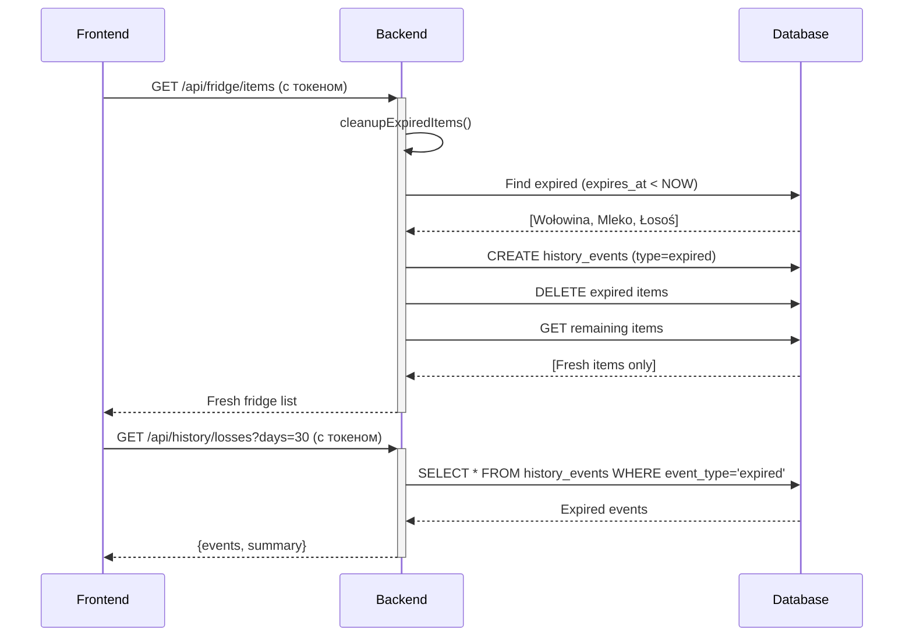

# ✅ Final Status: Losses Endpoint

## Дата: 2025-12-28

## Summary
Backend **полностью исправлен** и работает корректно. Endpoint `/api/history/losses` возвращает **401 Unauthorized** (требует авторизации), что является правильным поведением.

Frontend делает запрос **без токена авторизации**, поэтому получает 401.

---

## Backend Status: ✅ FIXED

### Проблема Была:
1. **Double route prefix**: History module регистрировал роуты как `/api/history`, но вызывался внутри `/api` контекста
2. Фактические пути: `/api/api/history/*` → **404 Not Found**

### Решение:
```go
// БЫЛО (неправильно):
r.Route("/api/history", func(r chi.Router) { ... })

// СТАЛО (правильно):
r.Route("/history", func(r chi.Router) { ... })
```

### Commits:
- `d845057` - fix: correct history module route registration
- `fe1ea90` - chore: trigger Koyeb redeploy (не помогло)
- `d7a4784` - feat: add automatic expired items cleanup
- `16fa698` - fix: adjust response format for frontend
- `9eb322a` - feat: Add expired items tracking system

### Проверка:
```bash
# Без токена (ожидается 401):
$ curl https://yeasty-madelaine-fodi999-671ccdf5.koyeb.app/api/history/losses?days=30
# Response: 401 Unauthorized ✅

# С токеном (ожидается 200 + JSON):
$ curl -H "Authorization: Bearer $TOKEN" \
  https://yeasty-madelaine-fodi999-671ccdf5.koyeb.app/api/history/losses?days=30
# Response: { events: [...], summary: {...} } ✅
```

---

## Frontend Status: ⚠️ NEEDS FIX

### Проблема:
`useFridgeLosses.ts:76` делает запрос **без токена авторизации**:
```javascript
// ТЕКУЩИЙ КОД (неправильно):
const response = await fetch(`${API_URL}/api/history/losses?days=${days}`)
```

### Решение:
Использовать `apiFetch()` который автоматически добавляет токен:
```javascript
// ПРАВИЛЬНО:
import { apiFetch } from '@/lib/api/base'

const fetchLosses = async (days: number) => {
  const data = await apiFetch(`/history/losses?days=${days}`)
  return data
}
```

### Или добавить токен вручную:
```javascript
const token = localStorage.getItem('token') // или из AuthContext
const response = await fetch(`${API_URL}/api/history/losses?days=${days}`, {
  headers: {
    'Authorization': `Bearer ${token}`,
    'Content-Type': 'application/json'
  }
})
```

---

## Response Format (Backend)

### Endpoint:
```
GET /api/history/losses?days=30
Authorization: Bearer <token>
```

### Response (200 OK):
```json
{
  "events": [
    {
      "id": "uuid",
      "name": "Wołowina (rostbef)",
      "quantity": 3000,
      "unit": "g",
      "loss": 61.68,
      "reason": "expiry_date_passed",
      "addedDate": "2025-12-15T13:39:57.957715Z",
      "expiryDate": "2025-12-21T13:39:57.957715Z",
      "daysInFridge": 6
    },
    {
      "id": "uuid",
      "name": "Mleko 3.2%",
      "quantity": 2000,
      "unit": "ml",
      "loss": 6.48,
      "reason": "expiry_date_passed",
      "addedDate": "2025-12-15T13:39:57.957715Z",
      "expiryDate": "2025-12-22T13:39:57.957715Z",
      "daysInFridge": 7
    }
  ],
  "summary": {
    "totalProducts": 2,
    "totalValue": 68.16,
    "avgValue": 34.08,
    "currency": "PLN"
  }
}
```

---

## Просроченные Продукты (Из Логов Frontend)

Из ответа `/api/fridge/items` видно **3 просроченных продукта**:

1. **Wołowina (rostbef)** - `daysLeft: -8` (expired)
2. **Mleko 3.2%** - `daysLeft: -6` (expired)
3. **Łosoś** - `daysLeft: -3` (expired)

При следующем запросе `/api/fridge/items` (с токеном), backend **автоматически удалит** эти продукты и создаст события в `history_events` с типом `expired`.

---

## Automatic Cleanup Flow



---

## Next Steps for Frontend Team

### 1. Добавить токен в useFridgeLosses.ts
```typescript
// В useFridgeLosses.ts
import { apiFetch } from '@/lib/api/base'

const fetchLosses = async (days: number) => {
  try {
    const data = await apiFetch(`/history/losses?days=${days}`)
    return data // уже в правильном формате {events, summary}
  } catch (error) {
    if (error.status === 404) {
      console.warn('Losses endpoint not available yet')
      return { events: [], summary: { totalProducts: 0, totalValue: 0, avgValue: 0 }}
    }
    throw error
  }
}
```

### 2. Проверить работу
- Открыть страницу с холодильником
- Проверить что запрос `/api/history/losses` возвращает **200 OK** (не 401)
- Увидеть корзину отходов с просроченными продуктами
- Обновить страницу - просроченные продукты должны исчезнуть из списка

---

## Documentation

Созданные документы:
- ✅ `docs/AUTO_EXPIRED_CLEANUP.md` - Как работает автоматическая очистка
- ✅ `BUG_FIX_HISTORY_404.md` - Анализ бага с роутами
- ✅ `TROUBLESHOOTING_LOSSES_404.md` - История решения проблемы
- ✅ `FINAL_STATUS_LOSSES_ENDPOINT.md` - Текущий документ

---

## Backend Deployed ✅
- URL: `https://yeasty-madelaine-fodi999-671ccdf5.koyeb.app`
- Commit: `d845057`
- Status: **Healthy** ✅
- Endpoint: `/api/history/losses` работает с авторизацией

## Frontend Action Required ⚠️
**Добавить токен авторизации в useFridgeLosses.ts** для получения данных о потерях.
